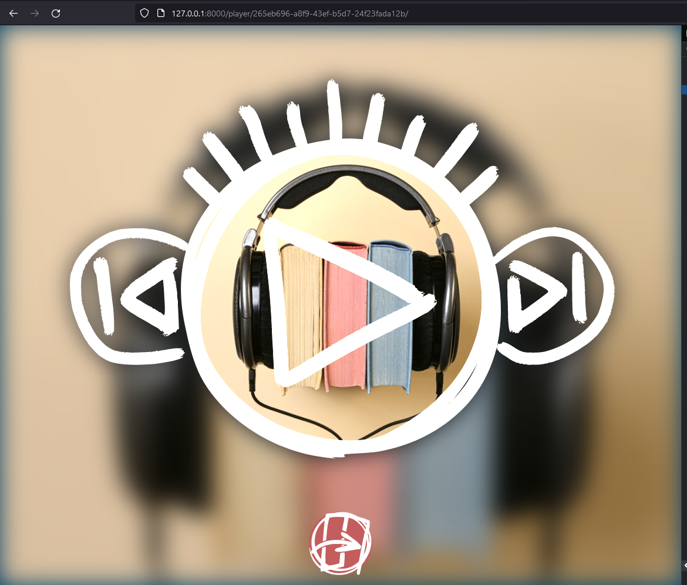
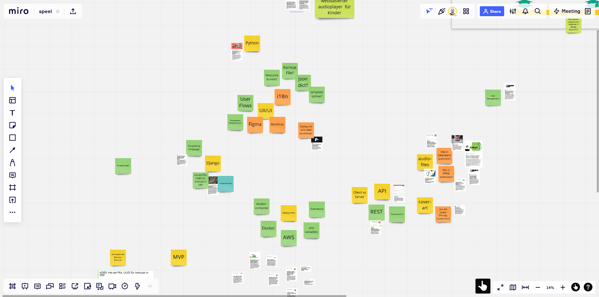
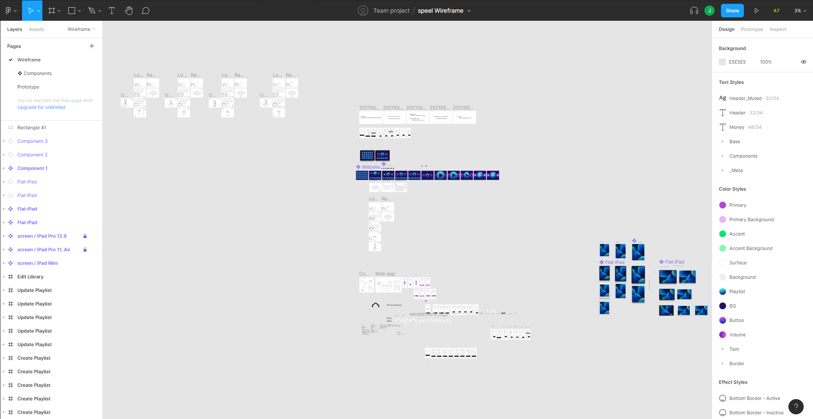
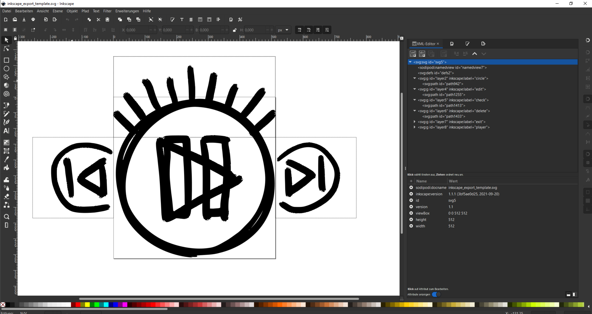

# _speel_

Hörbücher kinderleicht abspielen! 

Semesterprojekt im Wintersemester 21/22 für _Objektorientierte Scriptsprachen_ an der TH Brandenburg, betreut durch Prof. Dr. Thomas Preuss. 

## Features

Beide Projektteilnehmer haben Kinder im Alter von 3-4 Jahren, die gerne Hörbücher hören. Die vorhandenen Abspieler sind für die Kinder schwer zu bedienen oder ungeeignet. Wir wollten eine Plattform entwickeln, auf der man Hörbücher kinderleicht abspielen und verwalten kann. 

Eine Liste der Features von _speel_:
- Kinderleichtes Abspielen von Hörbüchern auf Tablet, Desktop oder Smartphone
- Textarmes Interface mit selbstgestalteten Icons und Bildern als Shortcuts für Hörbücher
- Kinder- und Elternmodus zum Anhören oder Verwalten von Hörbüchern
- Auslesen und Erzeugen von Meta-Informationen beim Upload von Hörbüchern
- Automatische Vergabe von Cover-Bildern für Hörbücher
- Nutzerverwaltung mit Registrierung, Login und Passwort-Rücksetzen per Email

## Technologien

Als Teil des Studienprojektes war Django als Technologie gegeben. 

- Django-Server mit serverseitig gerenderten Formularen zur Verwaltung von Hörbüchern und Nutzern OHNE JavaScript.
- TypeScript-Hörbuchspieler mit eigenen Vektor-Grafiken (svg) basierend auf howler.js
- SASS-Präprozessor für Stylesheets, die auf dem Server beim ersten Aufruf erzeugt und gecacht werden.
- Postgres-Datenbank im gleichen docker compose
- Deployment über Github-Actions als Azure-Webapp

## Anleitung

Um das Projekt im Container-Verbund mit der Postgres zu starten:
`docker compose up`
_speel_ ist lokal erreichbar unter `127.0.0.1:8000`
Nun kann mit einer validen Email-Adresse ein eigener Benutzer angelegt werden.
Außerdem wird als Standard-User angelegt: `mama` mit Passwort `admin`.

Nach dem Login befindet man sich in der Hörbuch-Mediathek der Anwendung. Unten links kommt man in den Verwaltungs- bzw. Eltern-Modus, in dem neue Hörbücher hochgeladen werden können.
Aus dem Eltern-Modus kommt man mit einem weiteren Klick unten links wieder zurück in den Anhör- bzw. Kinder-Modus.

## Projektverlauf

- Ideenfindung und Sammeln mit Miro-Board: 
- Prototypen in Django erstellt um Funktionalität kennen zu lernen (Routing, REST Framework, cookiecutter)
- Recherche Audio-Stream und Meta-Daten-APIs
- UX-Entwicklung mit Wireframes in Figma um Bedienkonzept zu entwickeln: 
- Player-Design und Icons erstellt: Gemalt in ArtFlow auf Android -> Inkscape in SVGs konvertiert und optimiert: 
- Continuous Deployment per Github Actions auf Azure als Azure Webapp im docker-compose Containerverbund
- Implementierung in Django, TypeScript, SASS
- HTTP-API für die Kommunikation von JS-Player auf dem Client mit dem Django-Server
- User-Testing mit Probanden

## Known issues / Ideen zur Verbessung

- Audio- und Cover-Dateien verbleiben auch nach Löschen eines Audiobooks auf dem Server -> Cronjobs mit Celery und Signals zum regelmäßigen clean-up
- Plausibilitätsprüfungen/Validierungen/Hardening im die Sicherheit der Anwendung zu Testen und zu Gewährleisten
- Bisher läuft die Anwendung im DEBUG-Modus und nicht mit einer Production Server / Reverse Proxy-Kombination wie Gunicorn mit nginx, auch statische Dateien werden bisher direkt von Django ausgeliefert
- Getrennter Datenbank-Dienst anstatt Ausführen der postgres aus dem gleichen docker-compose.
- Persistent Storage im Deployment (bisher werden mit jedem Reboot der Anwendung auf Azure alle Daten zurückgesetzt)

## Autoren

Friedemann Pruß ([github](https://www.github.com/fpruss)), Johannes Rave ([github](https://www.github.com/johannesrave))
